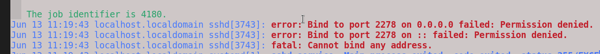
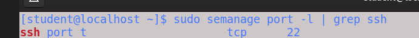
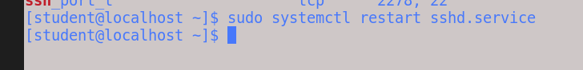
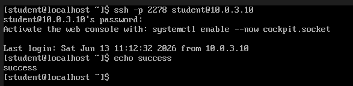

# Linux SSH Hardening

## Overview

This project demonstrates SSH hardening on a Rocky Linux 9 server.

The goal was to improve the security of remote administration by disabling direct root access, changing the default SSH port, restricting user access, configuring session timeouts, and troubleshooting SELinux restrictions encountered during implementation.

---

## Skills Demonstrated

- Linux Administration
- SSH Hardening
- SELinux Troubleshooting
- Firewalld Administration
- Systemd
- User Access Control
- Security Hardening
- Log Analysis
- Service Management
- Linux Troubleshooting

---

## Environment

| Component | Value |
|-----------|---------|
| OS | Rocky Linux 9 |
| Service | OpenSSH |
| Firewall | firewalld |
| SELinux | Enforcing |

---

## Objectives

- Disable direct root login
- Change SSH port from 22 to 2278
- Restrict SSH access to approved users
- Configure idle session timeout
- Open custom SSH port in firewalld
- Troubleshoot SELinux port binding issues
- Verify remote connectivity

---

## SSH Configuration

### Disable Direct Root Login

Direct root access was disabled to reduce the attack surface of the server.

```bash
PermitRootLogin no
```


---

### Configure a Non-Standard SSH Port

The SSH daemon was moved from the default port (22) to TCP port 2278.

```bash
Port 2278
```


---

### Restrict SSH Access

SSH access was restricted to only the student account.

```bash
AllowUsers student
```


---

### Configure Idle Session Timeout

Idle SSH sessions were automatically terminated after five minutes.

```bash
ClientAliveInterval 300
ClientAliveCountMax 0
```

---

## Firewall Configuration

A firewall rule was added to permit incoming SSH traffic on TCP port 2278.

```bash
sudo firewall-cmd --permanent --add-port=2278/tcp
sudo firewall-cmd --reload
```

---

## Issue Encountered

After modifying the SSH configuration and opening the firewall port, the SSH daemon failed to start.

The following error was observed:

```text
Bind to port 2278 failed: Permission denied
fatal: Cannot bind any address
```



At first glance, the issue appeared to be related to the firewall configuration. However, additional investigation was required to determine the root cause.

---

## Troubleshooting

System logs were reviewed using:

```bash
sudo journalctl -xeu sshd.service
```

The logs indicated that SSH was unable to bind to TCP port 2278.

Additional investigation was performed using the SELinux troubleshooting logs:

```bash
sudo journalctl -t setroubleshoot
```


The output revealed that SELinux was preventing the SSH daemon from binding to the custom port.

---

## Resolution

The existing SSH SELinux port contexts were reviewed:

```bash
sudo semanage port -l | grep ssh
```



The output showed that SSH was only permitted to use the default SSH port context.

A new SELinux port mapping was added to allow SSH to bind to TCP port 2278:

```bash
sudo semanage port -a -t ssh_port_t -p tcp 2278
```


The SSH service was then restarted successfully:

```bash
sudo systemctl restart sshd
```



---

## Verification

After updating the SELinux configuration, a successful SSH connection was established using the new port.

```bash
ssh -p 2278 student@server-ip
```



The SSH daemon successfully accepted connections on TCP port 2278 while maintaining SELinux in enforcing mode.

---

## Lessons Learned

- Firewalld and SELinux perform different security functions and must be configured independently.
- Opening a firewall port does not automatically permit a service to bind to that port.
- SELinux contexts must be updated when moving SSH to a non-standard port.
- Journal logs provide valuable information when troubleshooting service startup failures.
- Maintaining SELinux in enforcing mode provides additional security while still allowing custom service configurations when properly configured.

---

## Key Commands Used

```bash
sudo firewall-cmd --permanent --add-port=2278/tcp
sudo firewall-cmd --reload

sudo journalctl -xeu sshd.service
sudo journalctl -t setroubleshoot

sudo semanage port -l | grep ssh
sudo semanage port -a -t ssh_port_t -p tcp 2278

sudo systemctl restart sshd

ssh -p 2278 student@server-ip
